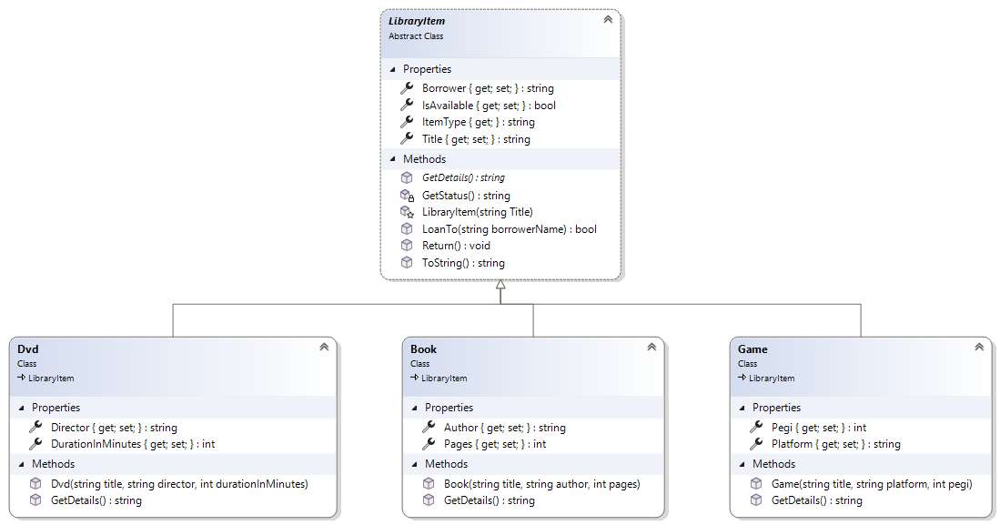
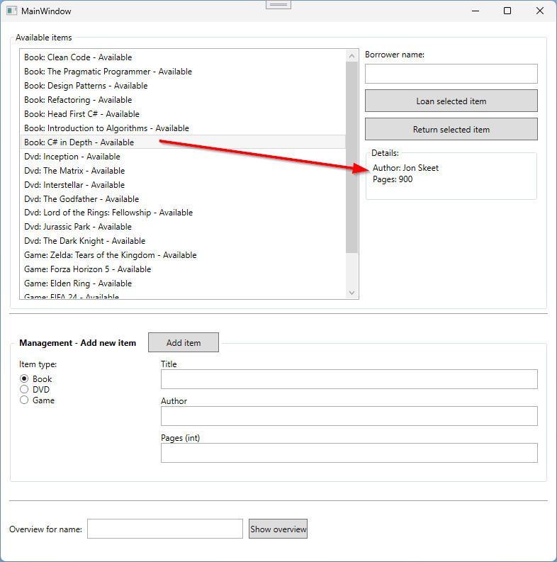
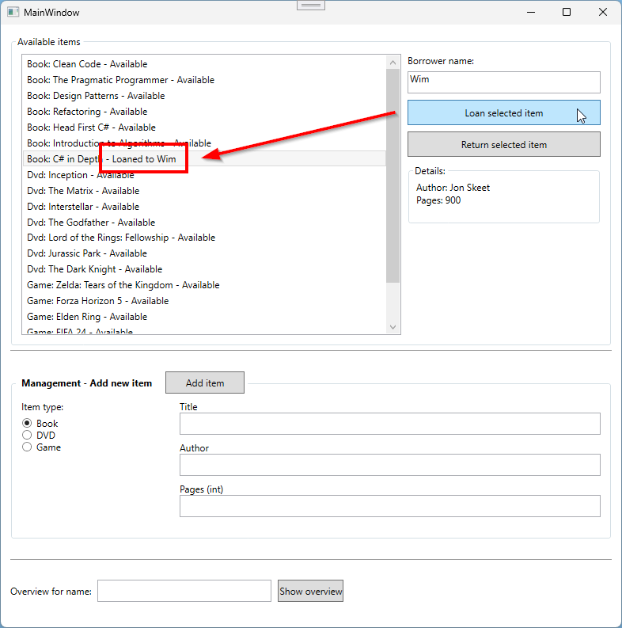
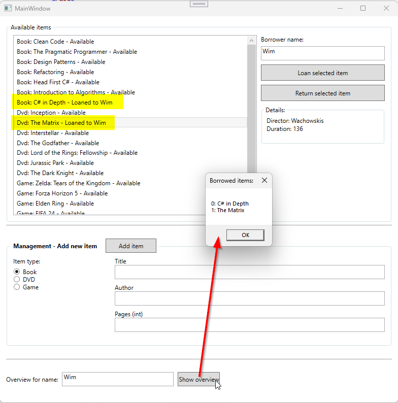
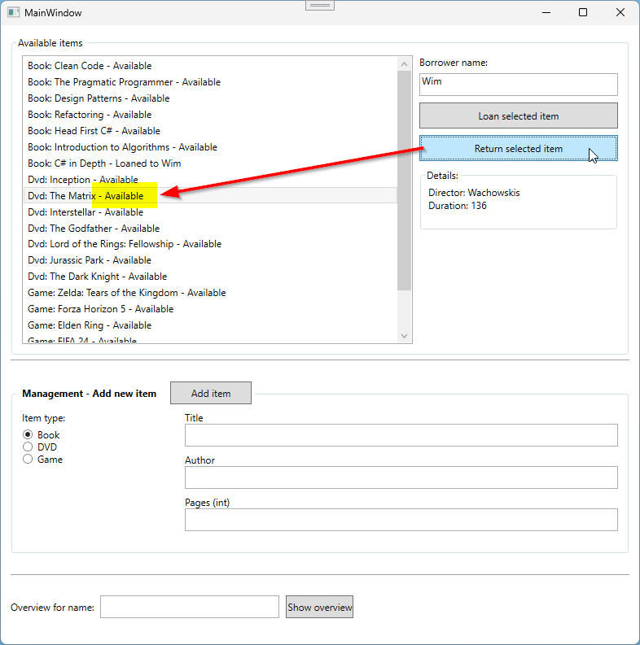
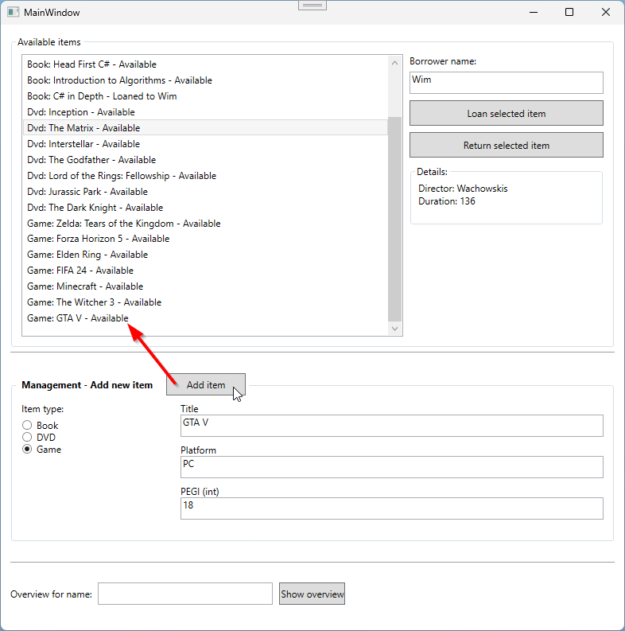

# BiblioManager

Via de BiblioManager worden de boeken, dvd's en games beheerd in een bibliotheek: 
- Er wordt een overzicht getoond van alle beschikbare items
- Een gebruiker kan een item uitlenen
- Een gebruiker kan een overzicht opvragen van zijn/haar uitgeleende items

## Models

- Maak een folder aan in je project: `Models`
- Voeg 4 klasses toe aan deze folder: 
    - `LibraryItem`
    - `Book`
    - `Dvd`
    - `Game`
- Implementeer onderstaande diagram:



### ItemType
- De `ItemType`-property kan je als volgt implementeren:
```
public string ItemType => GetType().Name; // "Book", "Dvd", "Game"
```

### GetStatus
- Deze functie geeft de tekst "Available" terug wanneer een item beschikbaar is
- Wanneer een item uitgeleend is wordt de tekst "Loaned to {Borrower}" geretourneerd

### ToString
- De `ToString()`-functie geeft de volgende informatie terug: `Type: Titel - Status`
- De status wordt opgehaald via de `GetStatus()`-functie

### GetDetails
- Deze functie geeft de specifieke eigenschappen van een item terug, elke eigenschap wordt in een nieuwe lijn getoond.
(zie screenshot *Details*)

### LoanTo
- Deze functie:
    - Returned `false` als een item niet beschikbaar is of de `borrowerName` leeg is 
    - Zet de `IsAvailable`-property op `false`
    - Vult de `Borowwer`-property met de `borrowerName`
    - Returned `true` als bovenstaande succesvol werd toegepast

### Return
- Deze methode maakt een item terug beschikbaar en wist de `Borrower`-property

## UI (XAML)
- De UI voor de applicatie is volledig afgewerkt

## Vereisten
Implementeer onderstaande vereisten:

### Init
- Initialiseer een lege lijst (`List`) van `LibraryItems` met de naam `_items` en zorg dat deze gevuld wordt tijdens het laden van het venster. Gebruik hiervoor de bestaande `SeedData`-functie.
Toon daarna alle items in de `ListBox`. Dit kan eenvoudig met de code: `lstItems.ItemsSource = _items;`
- Initialiseer een lege dictionary (`Dictionary<string, List<LibraryItem>>`) met de naam `_loans`. Hierin zullen de uitgeleende items per gebruiker worden bijgehouden.

### Details
- Zorg ervoor dat de details van een item getoond worden wanneer een item geselecteerd wordt in de `ListBox`

### Loan
- Zorg ervoor dat een item kan worden uitgeleend
    - Gebruik hiervoor de `LoanTo`-functie
    - Toon een `MessageBox` indien deze functie `false` returned
- Voeg indien nodig de `Borrower` toe aan de `Dictionary`
- Voeg het geselecteerde item toe aan de *loans*-`List` van de `Borrower`
- Refresh de items in de ListBox met `lstItems.Items.Refresh()`

### Overview
- Toon een `MessageBox` indien er geen gegevens bestaan voor de gekozen naam
- Toon een lijst van geleende items voor de gegeven naam (= Borrower)
- Zoek hiervoor de naam op in de `Dictionary` en loop door de bijhorende *loans*-`List`

### Return
- Implementeer de *Return*-knop met behulp van de `Return`-functie in de `LibraryItem`-klasse
- Verwijder ook het geselecteerde item uit de *loans*-`List` van de `Borrower`

### Add
- Voorzie de mogelijkheid om manueel items toe te voegen aan de `_items`-lijst
- Hou hiervoor rekening met het gekozen type (book, DVD of game) 
- Gebruik opnieuw `lstItems.Items.Refresh()` om de wijzigingen ook zichtbaar te maken in de `ListBox`

## Screenshots
### Details


### Loan


### Overview


### Return


### Add
